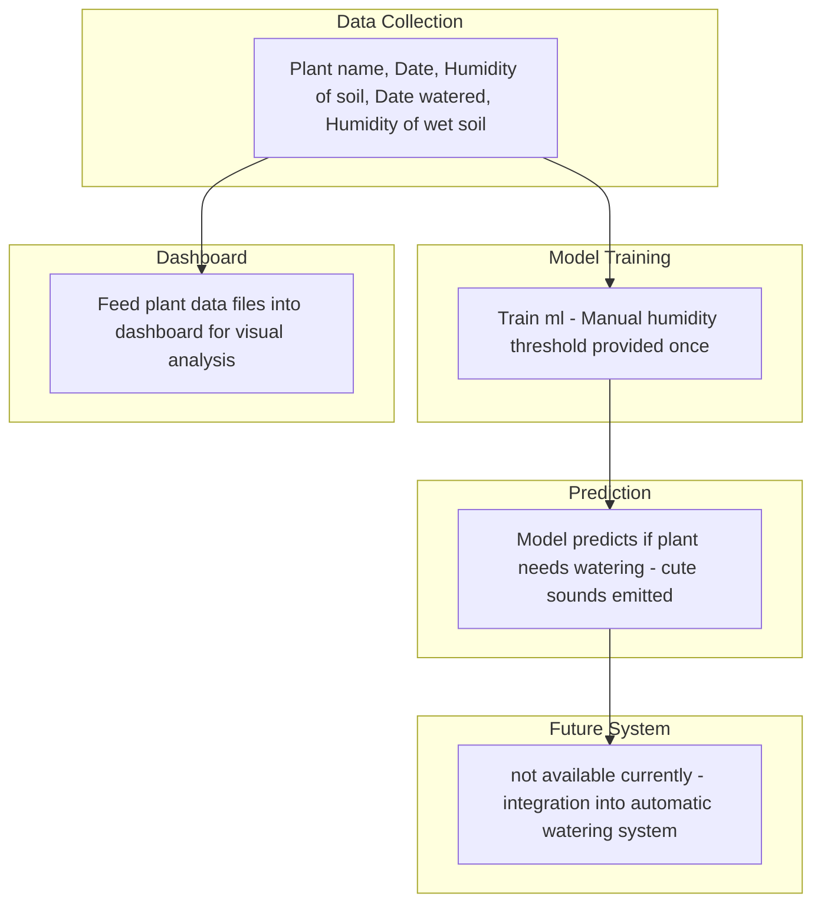

This version of the automatic watering system implements a decision tree ml model. This system uses collected humidty and watering data to train the ml to learn when to water your plant.
Using the GUI, create a 'plant diary' json file which is populated with the plant name, humidty value of days watered and not watered.
Feed this diary into the ml and predict if the plant needs watering today. The plant diaries will also be fed into a dashoboard to visually track the plant's stats.

# Collect plant data 		
* ./execute_testing_app.sh diary.json
## input
- .json file with plant information - { plant, day, voltage, water_day, water_voltage }
- you can create a new file by running the above bash script with 'none'
## output
- .json file with plant information

# Train ml and predict
* python ml_whentowater_custom.py diary.json
## input
- diary.json file created previously
## output
- trained decision tree model (currently basic greedy model)
- 1 or 0 corresponding with 'need watering' or 'all good, no watering needed'

# View dashboard
* python plot_dashboard.py diary.json
## input
- diary.json file created previously
## output
- html dashboard - follow Pi output address or laptop output address 
