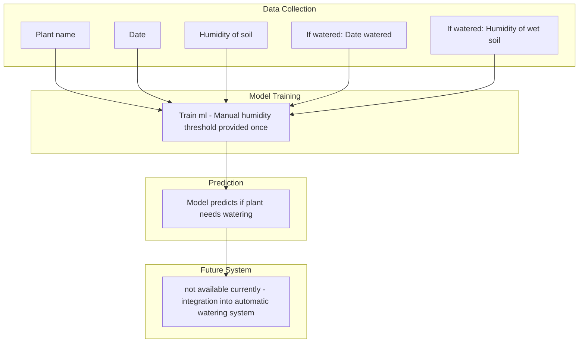

This version of the automatic watering system implements a decision tree ml model. This system uses collected humidty and watering data to train the ml to learn when to water your plant.
Using the GUI, create a 'plant diary' json file which is populated with the plant name, humidty value of days watered and not watered.
Feed this diary into the ml and predict if the plant needs watering today.

		
